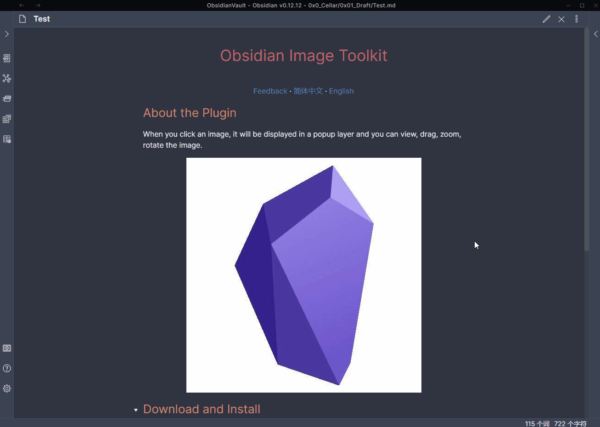

 <h1 align="center">Obsidian Image Toolkit</h1>
 

    Obsidian Image Toolkit is an Obsidian plug-in that can provide some image viewing toolkit.
     
    <a href="https://github.com/sissilab/obsidian-image-toolkit/issues">Feedback</a>
    ·
    <a href="/README_cn.md">简体中文</a>
    ·
    <a href="/README.md">English</a>

## About the Plugin
When you click an image, it will be displayed in a popup layer and you can view, drag, zoom, rotate, invert the image.

## Features
- Zoom in or out the image by mouse wheel.
- Move the image by mouse or keyboard (up, down, left, right).
- View the image in full-screen mode.
- Rotate the image by clicking footer toolbar icons.
- Invert the color of the image.
- Copy the image (You can only copy the original image now).
- Close the popup layer by Esc or clicking the outside of the image.

## Download and Install
[Enter the github release page to download.](https://github.com/sissilab/obsidian-image-toolkit/releases)

## Others
* It's just a simple verison, more new features will be in the future.
* Welcome to come up with some suggestions about this plugin.