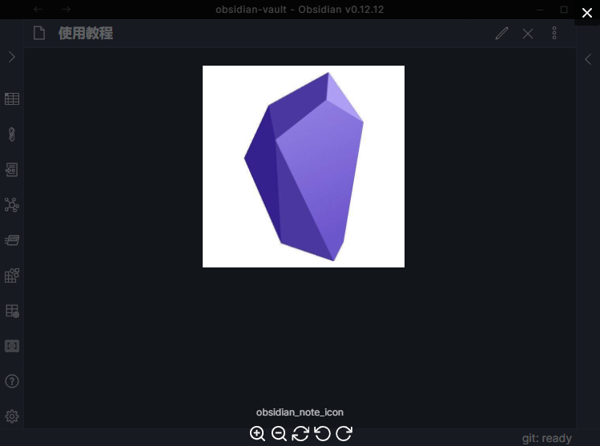

# obsidian-image-toolkit

When you click an image, it will be displayed in a popup layer and you can view, drag, zoom, rotate the image.

## Download and Install
[Enter the github release page to download.](https://github.com/sissilab/obsidian-image-toolkit/releases)

## Others
* It's just a simple verison, more new features will be in the future.
* Welcome to come up with some suggestions about image for obsidian plugin.