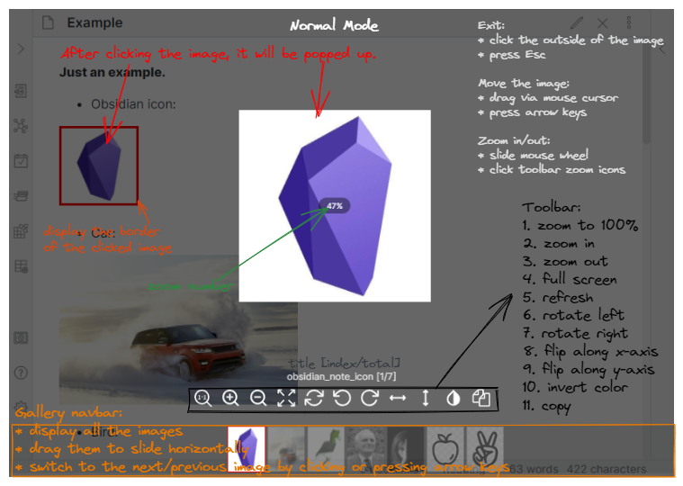

<h1 align="center">Obsidian Image Toolkit</h1>

    
    

    An Obsidian plugin for providing some image viewing toolkit
     
    <a href="https://github.com/sissilab/obsidian-image-toolkit/issues">Feedback</a>
    ·
    <a href="/README_cn.md">简体中文</a>
    ·
    <a href="/README.md">English</a>

## About the Plugin
When you click an image, it will be popped up and you can preview, zoom, move, rotate, flip, invert and copy the image.

## Basic Features
- Zoom in or out an image by mouse wheel or clicking toolbar zoom icons
- Move an image by dragging mouse cursor or pressing keyboard arrow keys
- Preview an image in full-screen mode
- Rotate or flip an image by clicking footer toolbar icons
- Invert the color of an image
- Copy an image
- Close the popup layer by pressing Esc or clicking the outside of the image.

## Normal Mode

When you turn off 'Pin an image' on the settings page, it's in normal mode. 

## Pin Mode

## Download and Install
[Enter the github release page to download.](https://github.com/sissilab/obsidian-image-toolkit/releases)

## Others
* Due to lack of sufficient time, this plug-in hasn't been tested in some themes. So any comment and suggestion is welcome!
* Welcome to come up with some suggestions about this plugin.

https://img.shields.io/badge/<LABEL>-<MESSAGE>-<COLOR>.svg
https://img.shields.io/github/v/release/ozntel/oz-image-in-editor-obsidian?style=for-the-badge
